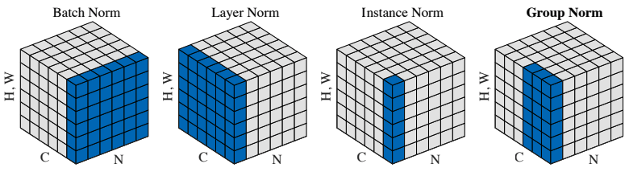
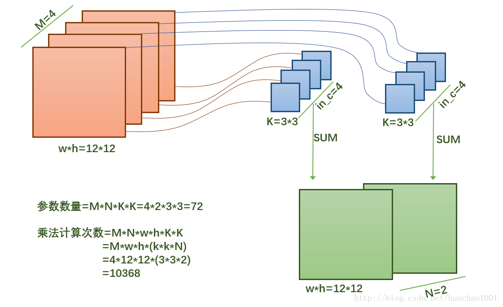
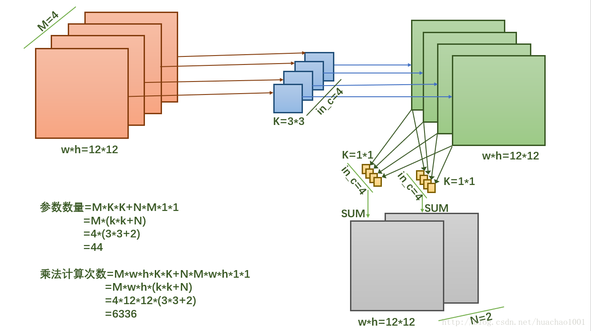
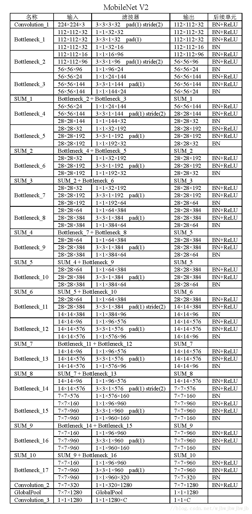

# Face_-classification_
记录自己在杭电创新实践课程做的内容--人脸分类


> * Group Normaliztion
> * 卷积原理
> * MobileNet
> * 使用VGG19+Group Normaliztion 在LFW上分类


## Group Normaliztion

在Group Normaliztion 的Jupyter notebook 里记录了2018年出的Group Normaliztion的实现方式

此外还记录了batch_norm、instance_norm、layer_norm


#### Group Normaliztion 代码实现：
```python

def group_norm(x, G=32, eps=1e-5, scope='group_norm') :
    with tf.variable_scope(scope) :
        N, H, W, C = x.get_shape().as_list()
        G = min(G, C)

        x = tf.reshape(x, [N, H, W, G, C // G])
        mean, var = tf.nn.moments(x, [1, 2, 4], keep_dims=True)
        x = (x - mean) / tf.sqrt(var + eps)

        gamma = tf.get_variable('gamma', [1, 1, 1, C], initializer=tf.constant_initializer(1.0))
        beta = tf.get_variable('beta', [1, 1, 1, C], initializer=tf.constant_initializer(0.0))


        x = tf.reshape(x, [N, H, W, C]) * gamma + beta

    return x
	
```




## 卷积原理

普通卷积



MobileNets使用的卷积




## MobileNet


MobileNet的Tensorflow实现.ipynb 文件 记录了使用Tensorflow实现MobileNet





## 使用VGG19+Group Normaliztion 在LFW上分类

由于硬件性能问题，未完善


